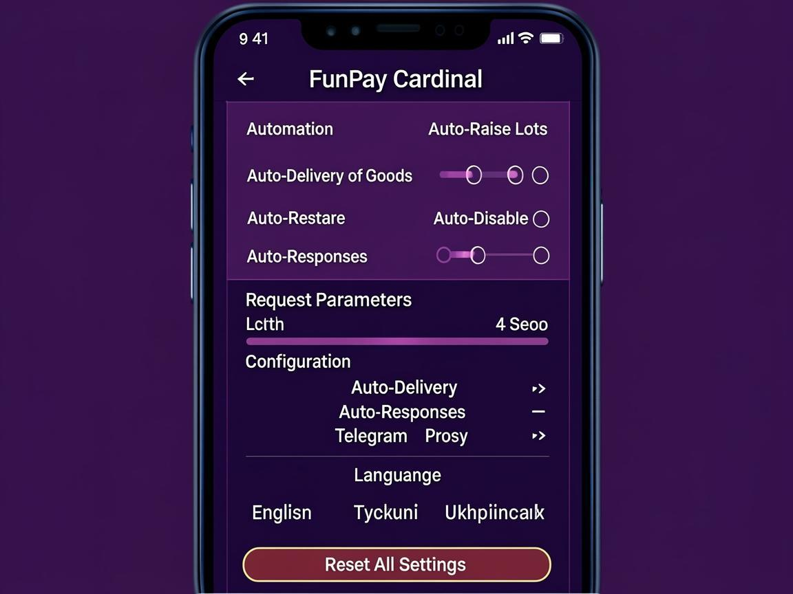

<div align="center">


# FunPay Cardinal — Android

**Мобильный бот-ассистент продавцов FunPay в вашем телефоне**

[](../../releases)
[](./LICENSE)
[](https://android.com)
[](https://kotlinlang.org)
[](https://python.org)
[](https://developer.android.com/jetpack/compose)

<a href="fastlane/metadata/android/ru-RU/images/phone_screenshot_1_dashboard.png">
  
</a>
<a href="fastlane/metadata/android/ru-RU/images/phone_screenshot_2_setup.png">
  
</a>
<a href="fastlane/metadata/android/ru-RU/images/phone_screenshot_3_settings.png">
  
</a>
<a href="fastlane/metadata/android/ru-RU/images/phone_screenshot_4_autodelivery.png">
  
</a>

**Полноценная мобильная версия** оригинального [FunPayCardinal](https://github.com/sidor0912/FunPayCardinal) с красивым UI, работающая прямо на вашем Android-устройстве.

[Скачать APK](../../releases) · [Сообщить об ошибке](../../issues) · [Предложить функцию](../../issues)

</div>

---

## О приложении

FunPay Cardinal для Android — это нативное мобильное приложение, которое заменяет CLI-версию оригинального FunPayCardinal и позволяет управлять всем функционалом бота прямо с телефона. Приложение встраивает полный Python-движок через Chaquopy, обеспечивая полную совместимость с оригинальным проектом.

### Ключевые возможности

| Функция | Описание |
|---------|----------|
| **Автоподнятие лотов** | Автоматическое поднятие ваших лотов на FunPay для повышения видимости |
| **Автодоставка товаров** | Мгновенная выдача цифровых товаров после оплаты заказа |
| **Автоответы** | Автоматические ответы на команды покупателей в чате |
| **Telegram панель** | Полный контроль через Telegram бота (уведомления, ответы, настройки) |
| **Автовосстановление** | Автоматическое восстановление лотов после продажи |
| **Автоотключение** | Отключение лотов при отсутствии товаров в файле |
| **Поддержка прокси** | Работа через SOCKS5/HTTP прокси для доступа к FunPay |
| **Мультиязычность** | Русский, English, Українська |
| **Фоновая работа** | Сервис работает в фоне с уведомлениями |
| **Без сжатия** | Полный Python 3.11 без ограничений, все библиотеки встроены |

---

## Технологии

<p align="center">
  
  
  
  
  
  
</p>

### Архитектура

```
app/
├── src/main/java/ru/funpay/cardinal/
│   ├── ui/                          # Jetpack Compose UI
│   │   ├── theme/                   # Цветовая схема и типографика
│   │   ├── screens/                 # Экраны приложения
│   │   │   ├── SetupScreen          # Первичная настройка
│   │   │   ├── DashboardScreen      # Главная панель управления
│   │   │   ├── SettingsScreen       # Настройки автоматизации
│   │   │   ├── LogsScreen           # Просмотр логов
│   │   │   ├── AutoDeliveryScreen   # Конфигурация автодоставки
│   │   │   ├── AutoResponseScreen   # Конфигурация автоответов
│   │   │   ├── TelegramSettingsScreen
│   │   │   └── ProxySettingsScreen
│   │   └── navigation/              # Навигация (NavHost)
│   ├── data/
│   │   ├── db/                      # Room Database
│   │   │   ├── entities/            # ConfigEntity, AutoDeliveryEntity и др.
│   │   │   └── dao/                 # Data Access Objects
│   │   └── repository/              # ConfigRepository
│   ├── viewmodel/                   # ViewModels (MVVM)
│   ├── python/                      # CardinalBridge (Chaquopy)
│   └── service/                     # Foreground Service
└── src/main/assets/python/          # Встроенные Python модули
    └── funpaycardinal/
        ├── main.py                  # Точка входа
        ├── config_generator.py      # Генератор конфигурации
        └── cardinal_core/           # Адаптированные модули Cardinal
```

---

## Сборка из исходного кода

### Требования

- **Android Studio** Hedgehog (2023.1.1) или новее
- **JDK** 17+
- **Android SDK** с compileSdk 34
- **Gradle** 8.5+

### Инструкция

```bash
# 1. Клонировать репозиторий
git clone https://github.com/USER/FunPayCardinal-Android.git
cd FunPayCardinal-Android

# 2. Открыть проект в Android Studio
# File → Open → выбрать папку проекта

# 3. Синхронизировать Gradle
# Файл → Sync Project with Gradle Files

# 4. Собрать APK
./gradlew assembleDebug

# APK будет в: app/build/outputs/apk/debug/
```

### Сборка релизной версии

```bash
# Создайте keystore (если его нет)
keytool -genkey -v -keystore cardinal-release.jks -keyalg RSA -keysize 2048 -validity 10000 -alias cardinal

# Добавьте подпись в app/build.gradle.kts (signingConfigs)

# Соберите релиз
./gradlew assembleRelease
```

---

## Установка

### Через APK (ручная)

1. Скачайте APK из раздела [Releases](../../releases)
2. Включите «Установка из неизвестных источников» в настройках Android
3. Установите APK
4. Запустите приложение и введите свой Golden Key

### Первичная настройка

1. **Получите Golden Key**: Зайдите на FunPay в браузере → DevTools → Application → Cookies → `golden_key`
2. **Скопируйте User Agent**: В том же браузере → Network → Headers → `User-Agent`
3. **(Опционально) Telegram бот**: Создайте бота через @BotFather (имя должно начинаться с `funpay`)
4. Введите данные в приложении и нажмите «Сохранить и продолжить»
5. На главной панели нажмите «Запустить Cardinal»

---

## Python-зависимости (встроены через Chaquopy)

Все библиотеки устанавливаются автоматически при сборке. Без сжатия, полная функциональность.

| Библиотека | Версия | Назначение |
|-----------|--------|------------|
| `requests` | 2.28.1 | HTTP-клиент для FunPay API |
| `beautifulsoup4` | latest | Парсинг HTML-страниц FunPay |
| `psutil` | latest | Мониторинг ресурсов системы |
| `colorama` | latest | Цветной вывод в логи |
| `pytelegrambotapi` | 4.15.2 | Telegram Bot API |
| `pillow` | latest | Обработка изображений |
| `requests_toolbelt` | 0.10.1 | Multipart-кодирование |
| `lxml` | latest | Быстрый парсер HTML/XML |
| `bcrypt` | latest | Хеширование паролей |
| `pysocks` | latest | SOCKS прокси поддержка |

---

## Безопасность

- Golden Key хранится в зашифрованной базе данных (EncryptedSharedPreferences)
- Секретный пароль хешируется через bcrypt
- Все запросы к FunPay проходят через HTTPS
- Python-код работает в изолированном окружении Chaquopy
- Минимум разрешений: только интернет и фоновая работа

---

## Оригинальный проект

Это мобильная адаптация [FunPayCardinal](https://github.com/sidor0912/FunPayCardinal) авторства **sidor0912**. Все права на оригинальный проект принадлежат его автору.

---

## Лицензия

Проект распространяется под лицензией [GNU General Public License v3.0](./LICENSE).

Python-зависимости распространяются под их собственными лицензиями:
- requests (Apache 2.0), beautifulsoup4 (MIT), psutil (BSD), colorama (BSD),
- pytelegrambotapi (GPL-3.0), pillow (HPND), lxml (BSD), bcrypt (Apache 2.0), pysocks (BSD)

---

<div align="center">

**Сделано с**  **и**  **для продавцов FunPay**

</div>
